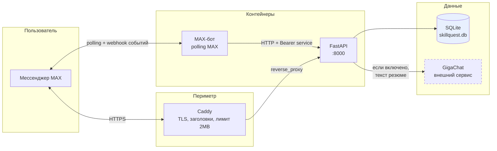
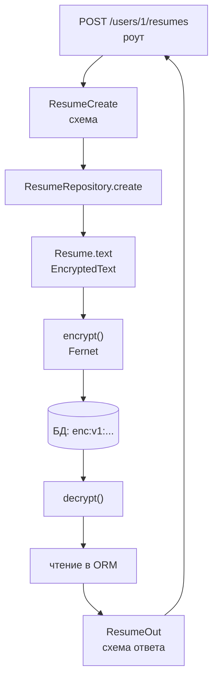
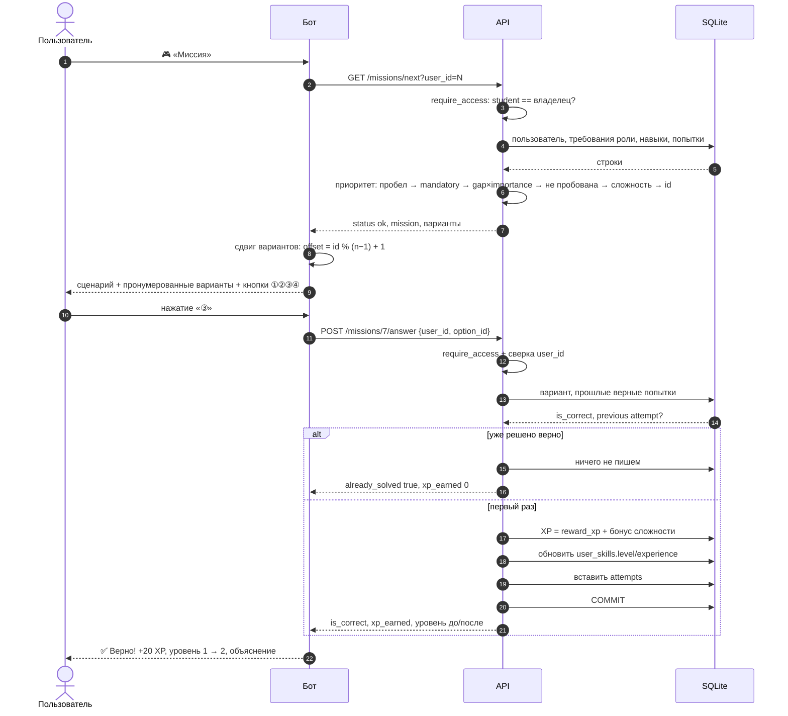
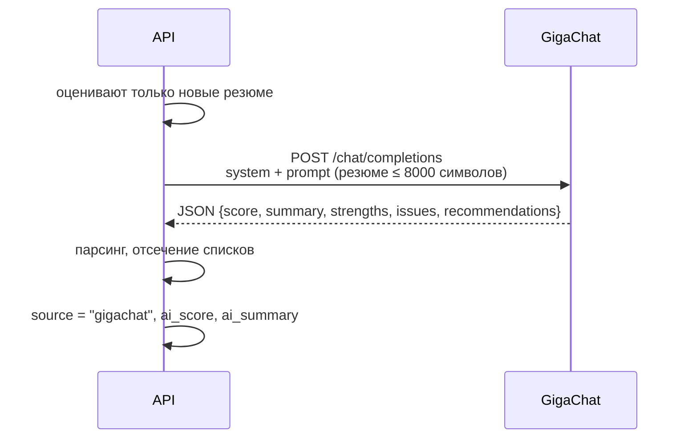
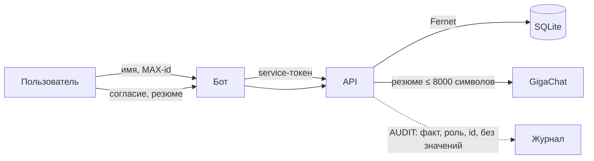

# Архитектура

Понять систему за 10 минут: кто с кем говорит, где что хранится и где
проходит граница ответственности.

---

## 1. Общая схема



Две входные точки:

- **Caddy** — для человека и внешних клиентов, единственная точка с TLS.
  Порт `8000` наружу не публикуется.
- **Бот** — длинный опрос (`polling`) событий MAX. Работает по
  внутренней сети Docker, в HTTPS не нуждается.

---

## 2. Слои

### Бот (`bot/`)

| Модуль | Ответственность |
|---|---|
| `main.py` | токен, диспетчер, роутеры, обработчик ошибок, polling |
| `handlers/` | экраны: цель, диагностика, миссия, Skill Map, резюме, рекомендации |
| `keyboards.py` | все клавиатуры и payload'ы кнопок |
| `texts.py` | весь текст, который видит пользователь |
| `sessions.py` | состояние диалога в памяти процесса |
| `api.py` | HTTP-клиент к API, единый путь Bearer-токена |

Бот **не решает** доменных задач: он не считает XP, не выбирает миссию и
не разбирает резюме. Он показывает экраны, собирает нажатия и зовёт API.

### API (`backend/`)

| Слой | Ответственность |
|---|---|
| `api/routes/` | HTTP: разбор запроса, коды ответов, OpenAPI |
| `api/deps.py` | аутентификация и авторизация: роли, владение, `401`/`403` |
| `schemas/` | pydantic-модели запросов и ответов |
| `services/` | правила игры: миссии, навыки, gap-анализ, рекомендации, анализ резюме |
| `repositories/` | доступ к данным, доменные ошибки `404` |
| `domain/` | модели SQLAlchemy |
| `database/` | движок, сессии, агрегация моделей |
| `core/` | настройки, шифрование, аудит, согласие, исключения |

### Слой шифрования

Включён в ORM, а не в роутеры, поэтому его нельзя обойти случайно:



`EncryptedString` / `EncryptedText` — `TypeDecorator` над `String`/`Text`:
шифруют в `process_bind_param`, расшифровывают в `process_result_value`.
Длина колонки увеличивается автоматически. Значения, записанные до
включения шифрования, не имеют префикса `enc:v1:` и читаются как есть.

Токены — отдельная история: в `api_tokens` лежит только SHA-256, они не
шифруются, а хэшируются, и при каждом запросе хэш пришедшего токена
ищется в таблице.

---

## 3. Ответ на миссию



Ключевое: обновление навыка и запись попытки идут **одной
транзакцией** (`commit=False` у обоих, `commit` делает сервис). Полученный
опыт не может «потеряться» или задваиться.

---

## 4. Границы ответственности

| Вопрос | Владелец |
|---|---|
| Какую кнопку показать дальше | бот |
| Как перевести payload в действие | бот |
| Может ли пользователь читать чужие данные | API |
| Какая миссия следующая | API |
| Сколько XP и какой уровень | API |
| Что найдено в резюме | API |
| Есть ли согласие на обработку | бот спрашивает, API хранит |
| Где лежат данные | API |

Правило: **бот не доверяет вводу пользователя**. `user_id` в теле
запроса сверяется с владельцем токена на стороне API
(`require_access`, `require_resume_owner`, `require_attempt_owner`).
Подмена `user_id` в теле даёт `403`, а не тихую запись чужим данным.

Правило: **API не знает про мессенджер**. У него нет представления о
кнопках, экранах и форматировании текста. Единственное исключение —
`POST /users/by-max`, связывающий `max_user_id` с профилем; он же
единственная операция, закрытая ролью `service`.

---

## 5. Где живёт состояние

| Состояние | Где | Что теряется |
|---|---|---|
| Профиль, цели, согласие | `users` | ничего |
| Skill Map, XP, попытки | `user_skills`, `attempts` | ничего |
| Резюме и разбор | `resumes`, `resume_analysis` | ничего |
| Токены, роли | `api_tokens` | ничего |
| Каталог контента | `skills`, `missions`, `roles`, `courses`, `internships` | ничего |
| **Диалог: `uid`, ответы диагностики, флаги резюме и согласия** | **память процесса бота** | **сбрасывается при рестарте бота** |
| Токен доступа бота | `api.py`, из переменной окружения | перечитывается при старте |
| HTTP-пул | `api._client` | пересоздаётся |

Сессии бота — `bot/sessions.py`, обычный словарь в памяти:

```python
sessions[max_user_id] = {
    "uid": None,       # id профиля на платформе
    "answers": [],     # ответы текущей диагностики
    "resume": False,   # ждём резюме
    "welcomed": False, # приветствие уже отправлено
    "consent": False,  # согласие на обработку ПД выдано
}
```

`uid` кэшируется, чтобы не делать `POST /users/by-max` на каждое
нажатие. Согласие **дублируется** в `users.consent_given`: в БД оно
живёт постоянно, в памяти — до перезапуска. После рестарта бот задаст
вопрос заново, что соответствует требованию явного согласия.

Ограничение сразу видно: два инстанса бота не разделяют состояние, и
перезапуск обрывает начатую диагностику. Перенёс состояния — замена
`bot/sessions.py` на FSM `maxapi.context.StateContext` с Redis-хранилищем
либо на чтение из БД; ключи сессии и точки вызова `sessions.*` при этом
не меняются.

---

## 6. Интеграции

### GigaChat

Выключена по умолчанию. Включается `GIGACHAT_CREDENTIALS` или
`GIGACHAT_ACCESS_TOKEN`.



Пока ключа нет, `GigaChatClient.configured` возвращает `False`, и разбор
остаётся эвристическим — отчёт помечается `source: "heuristic"`.
Любая ошибка сети или формата ловится и деградирует до эвристики:
неисправность внешнего сервиса не ломает разбор.

Что уходит наружу: текст резюме, найденные навыки, выбранное
направление. Это передача третьему лицу, раскрытая в политике и в
согласии — подробно в [PRIVACY.md](PRIVACY.md#4-передача-третьим-лицам).

### MAX

Библиотека `maxapi`: события (`bot_started`, `message_created`,
`message_callback`), `send_message`, `edit`, `download_bytes`, polling.
Ограничения площадки и карта экранов — в [BOT.md](BOT.md).

---

## 7. Поток данных персональных данных



Шифрование покрывает ПД в покое, TLS — в пути, аудит — доступ.
Подробно в [PRIVACY.md](PRIVACY.md).
