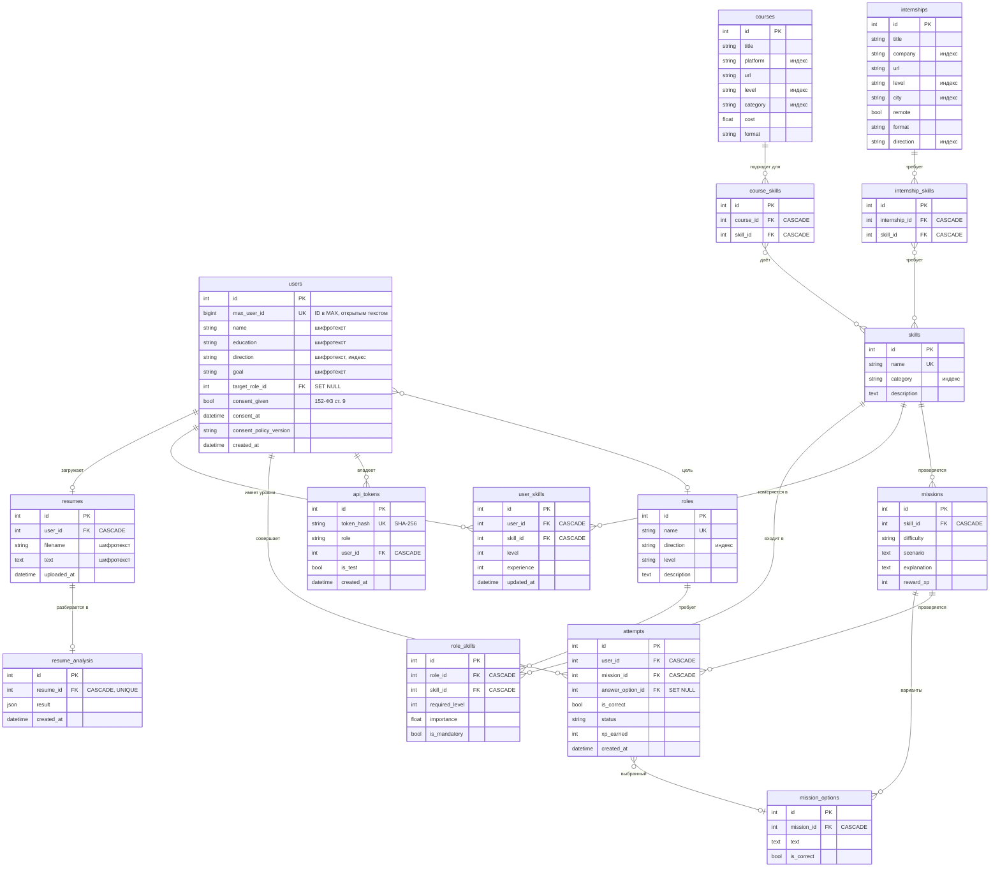

# Схема данных

Все таблицы описаны в `backend/app/domain/`, агрегированы в
`backend/app/database/models.py`, схема версионируется Alembic
(`backend/alembic/`). Источник правды — модели, миграции им
подчиняются.

---

## 1. ER-диаграмма



`course_skills` и `internship_skills` — таблицы-мосты «многие ко
многим» между каталогом и справочником навыков; обе несут
`UNIQUE (первая_колонка, skill_id)`, поэтому связь не может
задвоиться.

---

## 2. Назначение таблиц

### Игрок

| Таблица | Назначение |
|---|---|
| `users` | профиль: идентификатор MAX, имя, образование, направление, цель, целевая роль, состояние согласия |
| `user_skills` | Skill Map: уровень и опыт по каждому навыку |
| `attempts` | история попыток по миссиям и начисленный XP |
| `resumes` | загруженные резюме |
| `resume_analysis` | результат разбора: навыки, пробелы, сильные стороны, советы |
| `api_tokens` | Bearer-токены ролей `student` и `admin` |

### Каталог

| Таблица | Назначение |
|---|---|
| `skills` | справочник навыков: имя, категория, описание |
| `missions`, `mission_options` | задания и варианты ответа; `is_correct` не отдаётся в API |
| `roles` | целевые карьерные роли |
| `role_skills` | требования роли: нужный уровень, вес, обязательность |
| `courses`, `course_skills` | каталог курсов и их навыки |
| `internships`, `internship_skills` | каталог стажировок и их навыки |

### Как связано

- `users.target_role_id → roles.id` — одна роль на пользователя;
  `ON DELETE SET NULL`, чтобы удаление роли не удаляло профили;
- `user_skills`, `attempts`, `resumes`, `api_tokens` — `ON DELETE CASCADE`
  от пользователя: удаление аккаунта (`DELETE /users/{id}/data`) убирает
  их одной транзакцией;
- `role_skills`, `missions`, `course_skills`, `internship_skills` —
  `CASCADE` от каталога;
- `attempts.answer_option_id` — `SET NULL`, чтобы история попыток
  пережила удаление варианта ответа.

---

## 3. Зашифрованные колонки

| Таблица | Колонки | Тип в БД |
|---|---|---|
| `users` | `name`, `education`, `direction`, `goal` | `enc:v1:<Fernet>` |
| `resumes` | `text`, `filename` | `enc:v1:<Fernet>` |

Тип объявлен как `EncryptedString(length)` из
`backend/app/domain/types.py` — это `TypeDecorator` над `String`, который
шифрует при записи и расшифровывает при чтении. Длина колонки
увеличивается автоматически: шифротекст длиннее исходного, причём
кириллица в UTF-8 занимает до 4 байт на символ.

Открытыми остаются `id`, `max_user_id`, `target_role_id`, числовые
показатели и даты — по ним нужны индексы, соединения и агрегация.

Полное описание — в [PRIVACY.md](PRIVACY.md#2-что-зашифровано).

---

## 4. Индексы и ограничения

| Таблица | Индекс / ограничение | Зачем |
|---|---|---|
| `users` | `max_user_id` UNIQUE | get-or-create по MAX, защита от дублей |
| `users` | `direction` | выбор вопросов и направления |
| `users` | `target_role_id` | выбор миссий по роли |
| `skills` | `name` UNIQUE, `category` | поиск навыка по имени, фильтр по категории |
| `roles` | `name` UNIQUE, `direction` | фильтр ролей по направлению |
| `role_skills` | UNIQUE (`role_id`, `skill_id`) | нельзя задать одно требование дважды |
| `user_skills` | UNIQUE (`user_id`, `skill_id`) | один уровень на пару пользователь–навык |
| `missions` | `skill_id` | выбор пула миссий по навыку |
| `mission_options` | `mission_id` | загрузка вариантов |
| `attempts` | `user_id`, `mission_id` | прогресс, история, поиск верной попытки |
| `resumes` | `user_id` | список резюме пользователя |
| `resume_analysis` | `resume_id` UNIQUE | один разбор на резюме |
| `api_tokens` | `token_hash` UNIQUE | поиск по хэшу, запрет дубля токена |
| `api_tokens` | `user_id` | удаление токенов вместе с аккаунтом |
| `courses` | `platform`, `level`, `category` | фильтры каталога |
| `internships` | `company`, `level`, `city`, `direction` | фильтры каталога |
| `course_skills` | UNIQUE (`course_id`, `skill_id`) | без дублей |
| `internship_skills` | UNIQUE (`internship_id`, `skill_id`) | без дублей |

Полнотекстового индекса и внешних ключей с `FOREIGN KEY` в SQLite нет —
SQLite их не применяет без объявления. Логическая целостность
поддерживается на уровне ORM и `ON DELETE`-правил.

---

## 5. Миграции

Alembic, конфигурация `backend/alembic.ini`, версии
`backend/alembic/versions/`.

| Ревизия | Содержание |
|---|---|
| `001` | начальная схема: пользователи, навыки, миссии, курсы, стажировки |
| `002` | резюме и анализ |
| `003` | `users.max_user_id` |
| `004` | роли и требования |
| `005` | `api_tokens` |
| `006` | поля согласия + расширение колонок под шифротекст |

Применение — при старте контейнера (`backend/entrypoint.sh`). Вручную:

```bash
alembic -c backend/alembic.ini upgrade head          # применить
alembic -c backend/alembic.ini downgrade -1          # откатить на шаг
alembic -c backend/alembic.ini history               # что применено
```

### Как писать миграцию

1. Изменить модель в `backend/app/domain/`.
2. Сгенерировать автогенерацию:

   ```bash
   alembic -c backend/alembic.ini revision --autogenerate -m "описание"
   ```

3. **Прочитать полученный файл.** Автогенерация не знает про
   `EncryptedString`: изменение типа колонки она может не увидеть или
   увидеть как обычный `String`. Ширину под шифротекст
   (`encrypted_length(n)`) придётся задать вручную.
4. Если меняется тип колонки, обернуть в `batch_alter_table` —
   SQLite не умеет `ALTER COLUMN` иначе, Alembic пересоздаст таблицу:

   ```python
   with op.batch_alter_table("users") as batch:
       batch.alter_column("name", type_=sa.String(753), existing_type=sa.String(264))
   ```

5. `upgrade()` и `downgrade()` должны быть обратимы друг в друга.
6. Прогнать тесты: `cd backend && python -m pytest`.
7. Применить к копии рабочей базы и сверить количество строк до и после
   — `batch_alter_table` пересоздаёт таблицу.

### Правила

- на одну миграцию — одна тема; `006` совмещает добавление колонок и
  расширение ширин, потому что обе правки описывают одно изменение
  (появление шифрования);
- данные для бэкапа: `docker compose exec backend cp /app/data/skillquest.db /app/data/skillquest.db.bak`
  — миграции меняют схему, откат восстанавливает только схему;
- `Base.metadata.create_all` при старте (`auto_create_tables`) создаёт
  отсутствующие таблицы, но **не** меняет существующие — расхождение
  схемы лечится только миграцией.

---

## 6. Контентные таблицы

`skills`, `missions`, `mission_options`, `roles`, `role_skills`,
`courses`, `internships` наполняются из `backend/app/seed.py`.
Формат записей и правила их ведения — в [CONTENT.md](CONTENT.md).
