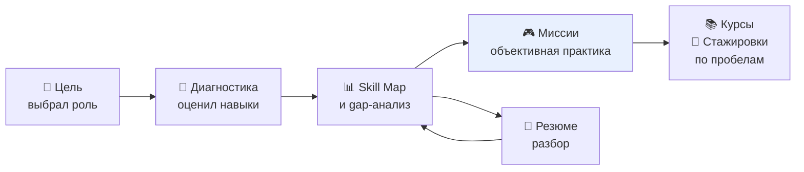

# Продукт

Зачем SkillQuest существует, для кого, что мы проверяем гипотезой и
сознательно не вошло в версию.

---

## 1. Проблема

Студент или junior-специалист выбирает направление и почти сразу упирается
в три вещи:

1. **Непонятно, чего не хватает.** Список технологий в вакансии не
   говорит, каких навыков конкретно не хватает до уровня, пригодного
   для отклика.
2. **Разрыв между «знаю» и «умею».** Просмотр курса даёт ощущение
   знания; написанный проект и решённая задача дают навык. Перехода из
   первого во второе нет.
3. **Рекомендации не связаны с человеком.** Каталог стажировок и курсов
   одинаков для всех: фронтендера с Python в резюме никто не спросит,
   чего ему не хватает.

Результат: либо человек учит лишнее, либо не доводит до уровня
отклика, либо откликается не туда.

---

## 2. Кому

| Сегмент | Что болит | Что даёт SkillQuest |
|---|---|---|
| Студент 1–3 курса | не понимает, с чего начать | «Цель» превращает список вакансий в проверяемый маршрут |
| Джуниор, меняющий профиль | разрыв в навыках при переходе | gap-анализ и план по пробелам |
| Соискатель без опыта | не понимает, что писать в резюме | разбор резюме с конкретными замечаниями |

Ядро — первый сегмент: у него есть время пройти маршрут, но нет
понимания, как его выстроить.

---

## 3. Как решаем

Ключевое отличие от каталога — **обратная связь, зависящая от действия**.
Миссия даёт верно/неверно, это объективно; диагностика даёт
самооценку, это субъективно. Платформа не смешивает их в одну цифру,
поэтому высокий балл диагностики не выглядит как достижение.

Три петли:

| Петля | Механика |
|---|---|
| Цель → практика | миссии подбираются строго по навыкам целевой роли |
| Практика → рекомендации | заработанный опыт меняет приоритет курсов и стажировок |
| Резюме → цель | разбор резюме показывает пробелы в навыках и дообучает карту |

---

## 4. Гипотезы

| # | Гипотеза | Как проверяем |
|---|---|---|
| H1 | студент без цели не начинает упражнения; с явной целью — проходит первую миссию | доля дошедших до первой миссии: с выбранной целью против без |
| H2 | первая закрытая миссия повышает возвращаемость | возвращаемость на 2-й и 7-й день у решивших первую миссию против не решивших |
| H3 | gap-анализ мотивирует сильнее общего процента | доля выбирающих курс сразу после просмотра gap-анализа |
| H4 | разбор резюме приводит к доработке и повторной загрузке | доля загрузивших резюме повторно в течение недели |
| H5 | рекомендации по направлению полезнее общего списка | открытие ссылок из рекомендаций против общего каталога |

### Метрики

| Метрика | Определение | Ориентир |
|---|---|---|
| Активация | доля новых, дошедших до первой закрытой миссии | ≥ 40% |
| Активация с резюме | доля новых, загрузивших резюме | ≥ 15% |
| Возвращаемость D1 / D7 | вернувшиеся на 2-й / 7-й день от даты первого запуска | D1 ≥ 30%, D7 ≥ 15% |
| Глубина практики | среднее число закрытых миссий на активного пользователя | ≥ 3 |
| Доля дошедших до миссии | новые, увидевшие экран миссии → закрывшие первую | ≥ 50% |
| Полнота профиля | доля выбравших цель | ≥ 60% |
| Работа с резюме | доля загрузивших, получивших отчёт без ошибки | ≥ 90% |
| Вовлечённость в рекомендации | открытие ссылки из подборки | ≥ 10% |

### Как считать

Продуктовой аналитики в проекте **нет**: события не пишутся в отдельную
таблицу, есть только технический аудит доступа к ПД
(`skillquest.audit`, см. [PRIVACY.md](PRIVACY.md#7-журнал-аудита)).

Аудит отвечает на вопрос «кто и когда читал данные», но не «что
пользователь делал»: он пишется в `read`/`create`/`update` на уровне
API, а не на уровне нажатий. Поэтому заявленные метрики сейчас
**не собираются** — их нужно либо считать по данным `attempts`
(глубина практики, активация), либо сначала добавить продуктовое
событие «пользователь дошёл до миссии N».

Минимальный набор, доступный из существующих таблиц: момент первой
записи в `attempts` (активация), число записей (глубина),
`users.target_role_id` (полнота профиля), `resumes` (работа с резюме).
Возвращаемость по когортам не считается — нет событий первого входа.

---

## 5. Что сознательно не вошло

| Не вошло | Почему | Что нужно, чтобы включить |
|---|---|---|
| Регистрация и вход по паролю | вход через мессенджер, лишний барьер для проверки ценности | отдельная сущность пользователя и экраны входа |
| Админка | токены `admin` и `student` выдаёт скрипт | интерфейс управления ролями |
| Задания с кодом и проверкой | требует изолированного исполнения, античита и лимитов | очередь задач, песочница, хранение результатов |
| Соцсеть и рефералки | механика роста, а не ценности; конфликтует с согласием на ПД | политика обработки и согласие на приглашения |
| Платежи | монетизация до проверки активации | подписки, закрытый контент |
| Веб-кабинет | приветствие и кнопки дешевле лендинга для проверки идеи | отдельный фронтенд |
| Импорт резюме с hh.ru | внешний источник ПД с отдельными условиями | правовое основание и договор |
| Уведомления о прогрессе | нужен внешний канал и расписание | интеграция с MAX-уведомлениями |
| Мультиязычность | аудитория русскоязычная | i18n в текстах и контенте |

---

## 6. Чем отличаемся

| Альтернатива | Отличие SkillQuest |
|---|---|
| Каталог курсов (Stepik, Skillbox) | не список, а привязка к пробелам конкретного человека и проверке результата |
| Тренажёры (LeetCode, Codewars) | проверка не синтаксиса, а пригодности к карьерной роли; навык задаёт путь, а не задачу |
| Тесты на профпригодность (Meta, Хекслет) | результат не «сдал/не сдал», а измеримый уровень и очередной шаг |
| Резюме-конструкторы | не правка формулировок, а поиск навыков и пробелов, влияющий на Skill Map и подбор миссий |
| Наставник, менторство | дешевле по масштабу, но без объективной обратной связи и без персонализации |

Суть отличия — **замкнутый контур**: диагностика задаёт уровень,
миссии его меняют, рекомендации следуют за пробелами, резюме
показывает, что из этого получилось. Каждый следующий шаг выводится из
накопленного, а не предлагается списком.

---

## 7. Границы

Платформа измеряет **пробелы в навыках и объективный результат
решения**. Она не измеряет:

- качество образования;
- формальный опыт работы;
- soft skills, коммуникацию, умение работать в команде;
- потенциал и мотивацию;
- то, насколько человек хорош как разработчик.

Диагностика — самооценка, и SkillQuest этого не скрывает: в отчёте о
целевой роли нет утверждения «ты подходишь», есть «не хватает N
уровней по M навыкам». Миссии дают объективную обратную связь и
поэтому отвечают на вопрос «умеет ли», а не «хочет ли».

Оценка резюме, если включён GigaChat, — мнение модели, а не
экспертиза рекрутера. Оно показывается вместе с эвристикой и пометкой
источника, чтобы пользователь понимал, что это разные сигналы.
