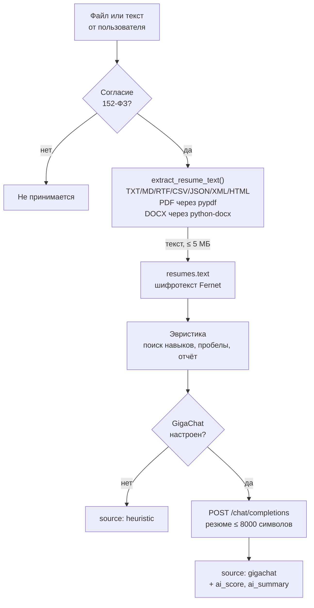

# Анализ резюме

Как устроен разбор, что он ищет, чего не умеет, и что уходит наружу, если
включён GigaChat. Код: `backend/app/services/resume_analysis.py`,
`resume_text.py`, `gigachat.py`.

---

## 1. Путь данных



---

## 2. Извлечение текста

`backend/app/services/resume_text.py`

| Формат | Как читается |
|---|---|
| `.txt` `.md` `.text` `.rtf` `.csv` `.json` `.xml` `.html` `.htm` | UTF-8, битые байты заменяются |
| без расширения | как текст |
| `.pdf` | `pypdf`, послойно `page.extract_text()` |
| `.docx` | `python-docx`: абзацы + таблицы через `" | "` |
| прочее | `422` «Формат не поддерживается» |

Ограничения:

- **5 МБ** — `MAX_RESUME_BYTES`, превышение даёт `422`;
- пустой файл или файл без текстового слоя — `422` с объяснением;
- **сканы не читаются**: у PDF без текстового слоя `extract_text()`
  вернёт пустоту. Ответ предлагает прислать текстовый вариант, а не
  молчит;
- неструктурированный текст не нормализуется: разметка, колонтитулы и
  порядок блоков сохраняются как есть.

---

## 3. Эвристика

Работает всегда, даже без GigaChat. Ответ помечается `source:
"heuristic"`.

### 3.1 Поиск навыков

Текст приводится к нижнему регистру и ищется **подстрока**, без
границ слов и без морфологии. Синонимы заданы в `SKILL_ALIASES`:

| Навык | Что ищется |
|---|---|
| Python | `python`, `питон` |
| SQL | `sql`, `postgresql`, `postgres`, `mysql`, `sqlite`, `бд` |
| Git | `git`, `github`, `gitlab` |
| JavaScript | `javascript`, `js`, `typescript` |
| HTML/CSS | `html`, `css` |
| React | `react` |
| FastAPI | `fastapi` |
| Docker | `docker`, `контейнер` |
| Алгоритмы и структуры данных | `алгоритм`, `структуры данных`, `leetcode` |
| Pandas | `pandas`, `numpy` |
| Machine Learning | `machine learning`, `машинное обучение`, `нейросет` |
| Testing | `тест`, `pytest`, `selenium`, `юнит` |
| Figma | `figma` |
| UI/UX | `ui`, `ux`, `интерфейс` |
| Коммуникация | `коммуникац` |
| Тайм-менеджмент | `тайм-менеджмент`, `управление временем` |

Навык без алиаса ищется по своему имени в нижнем регистре.

**Следствия подстрочного поиска:**

- `js` найдётся внутри любого слова с этими буквами;
- `бд` — внутри «судьба», «съездка» и подобных;
- `тест` — внутри «тестирование», но и внутри «протест»;
- `ui` и `ux` — внутри `quick`, `build`, `Linux`.

Ложные срабатывания поэтому возможны, и это осознанный размен: без них
опечатки и формы вроде «пайтон» теряли бы навык целиком.

**Чего эвристика не делает:** не разбирает структуру резюме, не
понимает синонимы и склонения, не читает формат «Опыт: 3 года» как
число лет, не различает «учился» и «работал», не оценивает уровень
навыка.

### 3.2 Пробелы

Требуемые навыки берутся по направлению пользователя из
`DIRECTION_REQUIRED_SKILLS` (таблица — в
[SCORING.md](SCORING.md#6-рекомендации)). Разрыв — навык из
обязательных, которого нет в найденных.

### 3.3 Замечания к резюме

Проверки в порядке появления в `issues`:

| Условие | Замечание |
|---|---|
| нет e-mail и нет телефона | «Не указаны контактные данные (почта или телефон)» |
| меньше 400 знаков | «Резюме слишком короткое — добавьте больше деталей» |
| нет `http`, `github.com`, `linkedin.com`, `behance.net`, `t.me` | «Нет ссылок на GitHub/LinkedIn/портфолио/Telegram» |
| нет `образован`, `учеб`, `вуз`, `университет` | «Не указано образование» |
| направление не упомянуто в тексте | «Резюме слабо связано с направлением «<направление>»» |
| не найден ни один навык | «Не удалось обнаружить профессиональные навыки…» |

Регулярные выражения: `EMAIL_RE` для адреса, `PHONE_RE` для
`+7…`/`8…` с группами цифр, `LINK_RE` для ссылок. Проверки наличия, а не
валидации: неверный адрес пройдёт.

### 3.4 Советы

Собираются из пробелов и замечаний, с дедупликацией по первым
совпадениям. Один совет на замечание, максимум пять показывается в
отчёте.

### 3.5 Процент соответствия направлению

```text
direction_match = round(найдено_обязательных / всего_обязательных × 100, 1)
```

Без направления — `50.0`. Это доля **обязательных** навыков, а не
оценка качества резюме.

---

## 4. GigaChat

Выключен по умолчанию. Включается `GIGACHAT_CREDENTIALS` или
`GIGACHAT_ACCESS_TOKEN`.

### 4.1 Что уходит наружу

| Поле | Значение |
|---|---|
| system prompt | фиксированная инструкция вернуть JSON со `score`, `summary`, `strengths`, `issues`, `recommendations` |
| user prompt | `Направление пользователя: <direction>` |
| | `Найденные навыки: <список>` |
| | `Не хватает навыков: <список>` |
| | `Текст резюме:` + первые **8000 символов** (`MAX_RESUME_CHARS`) |
| модель | `GIGACHAT_MODEL`, по умолчанию `GigaChat-3-Lightning` |
| temperature | `0.2` |
| адрес | `api.giga.chat`, OAuth на `ngw.devices.sberbank.ru` |

Текст обрезается по 8000 символам **до** отправки. Больше уходит только
направление, найденные навыки и список пробелов — производные от текста,
но не сам текст.

Имя, телефон и e-mail в промпт не попадают отдельными полями, но могут
присутствовать внутри самих 8000 символов резюме.

### 4.2 Что приходит обратно

```json
{
  "score": 0,
  "summary": "краткий вердикт",
  "strengths": ["..."],
  "issues": ["..."],
  "recommendations": ["..."]
}
```

Разбор ответа (`_parse_evaluation`): снимается markdown-обёртка через
регулярное выражение `\{.*\}` с `DOTALL`, поле `score` ограничивается
диапазоном `0…100`, каждый пункт списка обрезается до 300 символов
(`MAX_ITEM_CHARS`), список — до 5 пунктов (`MAX_LIST_ITEMS`), сводка —
до 600 символов (`MAX_SUMMARY_CHARS`). Значения, которые не строка и не
список, приводятся к строке или отбрасываются.

Поля `strengths`, `issues`, `recommendations` **заменяют** эвристические
только если модель вернула непустой список; иначе остаются
эвристические. `source` становится `gigachat`, добавляются `ai_score` и
`ai_summary`.

### 4.3 Отказоустойчивость

| Сбой | Поведение |
|---|---|
| ключ не задан | `configured` → `False`, запрос не выполняется, остаётся эвристика |
| сеть недоступна, таймаут, битый JSON | лог предупреждения, `None`, остаётся эвристика |
| `401` от GigaChat | кэш токена сбрасывается, запрос повторяется один раз |
| модель ответила без JSON | `ValueError`, перехватывается, остаётся эвристика |

Неисправность внешнего сервиса **никогда** не ломает разбор: все ошибки
(`httpx.HTTPError`, `ValueError`, `KeyError`, `TypeError`, `IndexError`)
перехватываются в `evaluate_resume`.

Токен кэшируется на 29 минут (`expires_at − 60` с ограничением по
`now + 1740`).

### 4.4 Проверка TLS

`GIGACHAT_CA_BUNDLE` — путь к CA-бандлу Минцифры, если системных
сертификатов недостаточно; иначе `GIGACHAT_VERIFY_SSL=true`. Образ
backend ставит `ca-certificates` и российские корни, поэтому локально
обычно достаточно системных.

---

## 5. Передача третьему лицу

GigaChat — третье лицо, поэтому передача раскрыта:

| Где | Что написано |
|---|---|
| `GET /consent/policy` | раздел «Передача третьим лицам»: состав, назначение, оператор, объём, адрес |
| флаг `ai_assessment_enabled` | истинен ровно тогда, когда GigaChat настроен, — предупреждение проверяемо |
| экран согласия в боте | строка про передачу текста резюме в GigaChat (Сбер), до приёма файла |
| `📄 Политика` в боте | то же в выжимке для чата |
| `docs/PRIVACY.md` | карта передачи |

Пользователь видит предупреждение **до** того, как резюме уходит
боту, и может отказаться — тогда резюме не обрабатывается.

---

Разбор доступен только владельцу резюме и роли `service`; чужой
`resume_id` даёт `403`.
